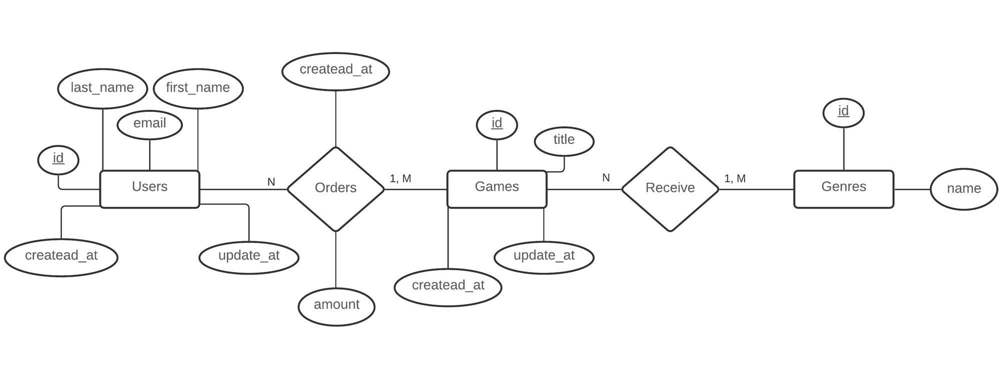
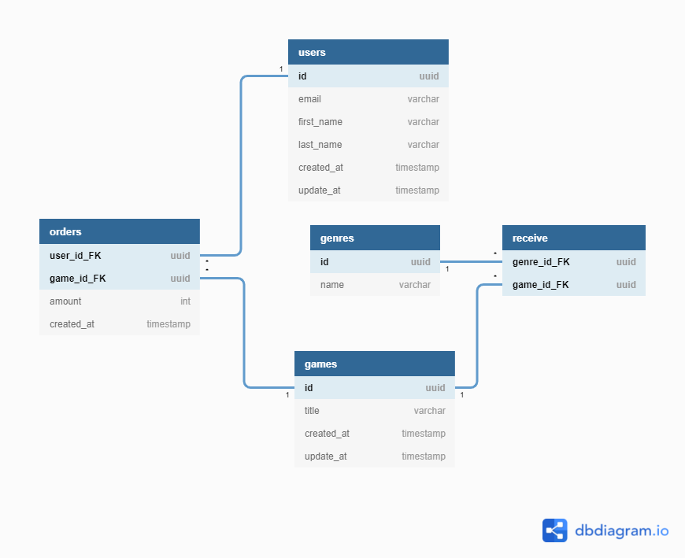

  

 

<h1 align="center">
  Desafio 2: Modelagem do banco de dados
</h1>

 

  
  
  
  

## :computer: Descrição:
A aplicação deve ter uma tabela de gêneros (genres) para que cada jogo possa ter um ou mais gênero e, além disso, uma tabela orders deve existir para que um usuário consiga comprar um ou mais jogos na mesma compra.

## :hammer_and_wrench: Modelo conceitual:

  

## :hammer_and_wrench: Esquema relacional:
- **users**(id_PK, email, first_name, last_name, created_at, update_at)
- **games**(id_PK, title, created_at, update_at)
- **genres**(id_PK, name)
- **orders**(user_id_FK, game_id_FK, amount, created_at)
- **receive**(genre_id_FK, game_id_FK) 
- 
## :hammer_and_wrench: Modelo relacional:

  

